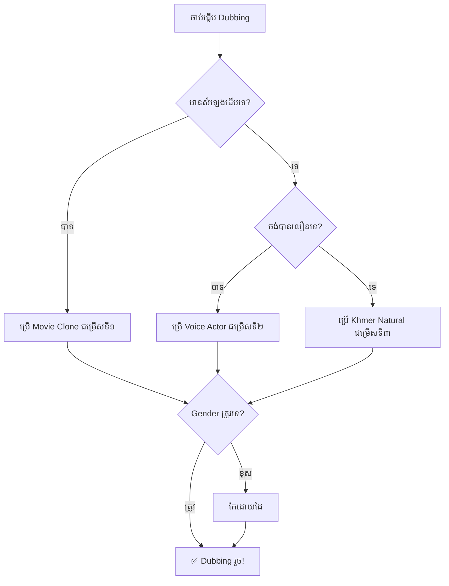

# 🎭 Voice System Guide - របៀបដោះស្រាយបញ្ហាសំឡេង

## 🚨 បញ្ហាញឹកញាប់ (Common Issues)

### 1. 😱 តួប្រុសនិយាយសំឡេងស្រី / តួស្រីនិយាយសំឡេងប្រុស

**មូលហេតុ:**
- AI ស្វែងយល់ភេទខុស
- Gender detection មិនត្រឹមត្រូវ
- ឈ្មោះតួអង្គមិនច្បាស់លាស់

**ដំណោះស្រាយ:**

#### ✅ វិធី ១: ប្រើ Voice Mode ត្រឹមត្រូវ
```
1. បើក Dubbing Studio
2. រកមើល "🎭 របៀបសំឡេង (Voice Mode)"
3. ជ្រើសរើស:
   🎭 ជម្រើសទី ២: Voice Actor Clone (ណែនាំ - មិនច្រឡំភេទ!)
```

#### ✅ វិធី ២: កែតម្រូវដោយដៃ
```
1. ចុចប៊ូតុង "🎭 តួអង្គ (X)"
2. រកតួអង្គដែលខុស
3. ជ្រើសរើសសំឡេងដែលត្រូវភេទ:
   - តួប្រុស → ជ្រើសពី "🎙️ សំឡេងតួប្រុស"
   - តួស្រី → ជ្រើសពី "🌸 សំឡេងតួស្រី"
```

#### ✅ វិធី ៣: ជួសជុល Gender Detection
កែឈ្មោះតួអង្គក្នុង Timeline:
- បន្ថែម "ប្រុស" ឬ "ស្រី" ក្នុងឈ្មោះ
- ឧទាហរណ៍: "តួឯកប្រុស", "នាងស្រី", "អ្នកប្រុស"

---

### 2. 🎯 របៀបប្រើ Movie Clone (ស្រង់សំឡេងពីរឿងដើម)

**ជំហានៗ:**

#### ជំហានទី ១: ស្កេនវីដេអូ
```
1. Upload វីដេអូរបស់អ្នក
2. ចុច "🔍 ស្កេន AI & Subtitle"
3. រង់ចាំឱ្យប្រព័ន្ធស្រង់សំឡេងតួអង្គ
```

#### ជំហានទី ២: ជ្រើសរើស Voice Mode
```
1. បើក "🎭 របៀបសំឡេង (Voice Mode)"
2. ជ្រើសរើស:
   🎯 ជម្រើសទី ១: Clone សំឡេងផ្ទាល់ពីរឿងដើមទាំងអស់
```

#### ជំហានទី ៣: Dubbing
```
1. ចុច "⚡ បញ្ចូលសំឡេងភ្លាមៗ"
2. ប្រព័ន្ធនឹងប្រើសំឡេងដែលស្រង់ពីរឿងដើម
3. រង់ចាំលទ្ធផល! 🎬
```

⚠️ **សម្គាល់:**
- Movie Clone ត្រូវការស្កេនរឿងជាមុនសិន
- សំឡេងត្រូវច្បាស់ និងគុណភាពល្អ
- ប្រសិនបើមិនមានសំឡេង Clone នឹង fallback ទៅ Voice Actor

---

## 🎛️ Voice Mode ទាំង ៣ ប្រភេទ

### 🎯 ជម្រើសទី ១: Movie Clone (Clone ពីរឿងដើម)
**គុណសម្បត្តិ:**
- ✅ សំឡេងដូចរឿងដើម ១០០%
- ✅ រក្សាការសម្តែងដើម
- ✅ ប្រភេទរឿងណាក៏បាន

**គុណវិបត្តិ:**
- ❌ ត្រូវការស្កេនរឿងជាមុនសិន
- ❌ ត្រូវការសំឡេងច្បាស់
- ❌ យឺតជាង (ត្រូវស្រង់សំឡេង)

**ប្រើសម្រាប់:**
- រឿងដែលចង់រក្សាសំឡេងដើម
- រឿងដែលមានតួអង្គច្រើន
- ចង់បានភាពដើមពិតប្រាកដ

---

### 🎭 ជម្រើសទី ២: Voice Actor Clone (ណែនាំ!)
**គុណសម្បត្តិ:**
- ✅ ៣៨+ សំឡេង Voice Actor ខ្មែរ
- ✅ **មិនច្រឡំភេទ** (ស្រី ↔️ ប្រុស ដាច់ដោយឡែក)
- ✅ លឿន - មិនត្រូវការស្កេន
- ✅ គុណភាពខ្ពស់
- ✅ ១ តួអង្គ = ១ សំឡេង (មិនជាន់គ្នា)

**គុណវិបត្តិ:**
- ❌ សំឡេងមិនដូចរឿងដើមទេ
- ❌ ត្រូវការ Library Voice

**ប្រើសម្រាប់:**
- Dubbing ទូទៅ (ណែនាំ!)
- នៅពេលមិនមានសំឡេងដើម
- ចង់បានលទ្ធផលលឿន
- ចង់ជៀសវាងបញ្ហាច្រឡំភេទ

---

### 🎙️ ជម្រើសទី ៣: Khmer Natural
**គុណសម្បត្តិ:**
- ✅ សំឡេងខ្មែរធម្មជាតិ
- ✅ លឿនបំផុត
- ✅ ច្បាស់ ពិរោះ
- ✅ ឥតគិតថ្លៃ (Edge TTS)

**គុណវិបត្តិ:**
- ❌ តួអង្គ ២ ប្រភេទប៉ុណ្ណោះ (Piseth ប្រុស / Sreymom ស្រី)
- ❌ អារម្មណ៍តិច
- ❌ មិនមានការសម្តែង theatrical

**ប្រើសម្រាប់:**
- Dubbing ធម្មតា
- ការសាកល្បង
- រឿងធម្មតា (មិនមែន action/drama)

---

## 🔧 ការជួសជុល Gender Detection

### បង្កើនភាពត្រឹមត្រូវ:

#### 1. ប្រើពាក្យកំណត់ច្បាស់
តួ**ប្រុស:**
- ប្រុស, លោក, បង, ឪពុក, តា, អ៊ំប្រុស
- មេទ័ព, កូនចៅ, ព្រះអង្គ, ស្វាមី
- តួឯកប្រុស, កូនប្រុស

តួ**ស្រី:**
- ស្រី, នាង, ម៉ាក់, យាយ, អ៊ំស្រី
- ភរិយា, កូនស្រី, តួឯកស្រី
- នារី, ក្រមុំ

#### 2. កែក្នុង Timeline
```javascript
// ឧទាហរណ៍:
"តួអង្គ ១" → "តួឯកប្រុស"
"Speaker 2" → "នាងស្រី"
"角色3" → "អ្នកប្រុសធំ"
```

#### 3. Manual Override
```
1. បើក Character Cast Drawer
2. ជ្រើសរើសសំឡេងដោយដៃ
3. រក្សាទុក
```

---

## 📊 Decision Tree



---

## 💡 Tips & Best Practices

### ✅ DO (គួរធ្វើ)
1. **ប្រើ Voice Actor mode** ជាមធ្យម (ណែនាំ)
2. **ពិនិត្យ Gender** បន្ទាប់ពីស្កេន
3. **កែឈ្មោះតួអង្គ** ឱ្យច្បាស់លាស់
4. **Preview** មុនពេល export
5. **រក្សាទុក project** ញឹកញាប់

### ❌ DON'T (មិនគួរធ្វើ)
1. **កុំប្រើ Movie Clone** ទាន់តែដំបូង
2. **កុំរំលងការពិនិត្យ** Gender
3. **កុំប្រើឈ្មោះ** មិនច្បាស់ ("Speaker 1", "角色")
4. **កុំលោតជំហាន** ស្កេន AI
5. **កុំប្រើសំឡេង** ខុសភេទ

---

## 🆘 Troubleshooting

### បញ្ហា: តួប្រុសនិយាយសំឡេងស្រី
**ដំណោះស្រាយ:**
1. ពិនិត្យ Voice Mode (ប្រើ Voice Actor)
2. កែ Gender ក្នុង Character Cast
3. ពិនិត្យឈ្មោះតួអង្គ (បន្ថែម "ប្រុស")

### បញ្ហា: Movie Clone មិនដំណើរការ
**ដំណោះស្រាយ:**
1. ពិនិត្យថាបានស្កេនរឿងឬនៅ
2. ពិនិត្យគុណភាពសំឡេងដើម
3. Fallback ទៅ Voice Actor

### បញ្ហា: សំឡេងមិនច្បាស់
**ដំណោះស្រាយ:**
1. បង្កើន Volume parameters
2. ប្តូរ voice sample
3. ប្រើ Natural mode

---

## 📚 ឯកសារយោង

- [EMOTIONAL_VOICE_GUIDE.md](./EMOTIONAL_VOICE_GUIDE.md) - អារម្មណ៍សំឡេង
- [API Documentation](./server.py) - Backend API
- [Character Voices](./extracted_characters.json) - Voice Library

---

**បានបង្កើតដោយ**: Cheatz Dabber Studio 🎬  
**Version**: 2.0.0  
**Updated**: 2024
